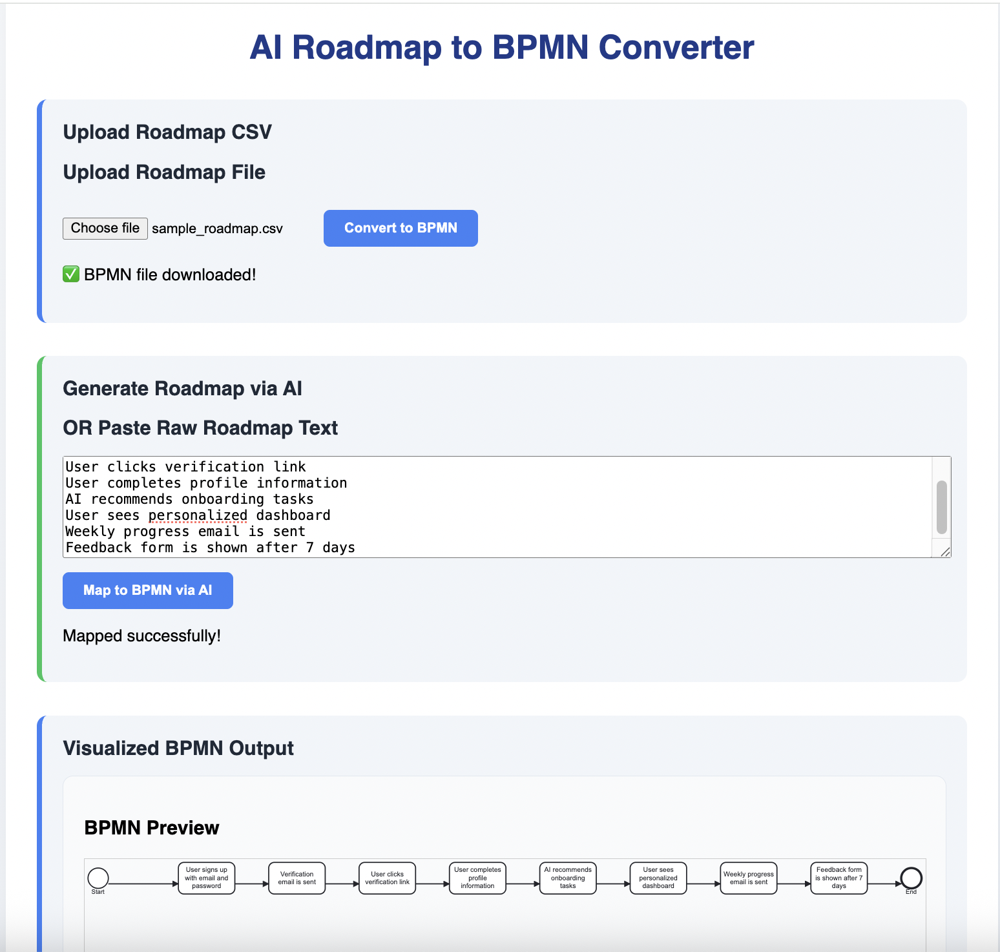

#  AI Roadmap → BPMN Workflow Converter

Convert product or project roadmaps into clean, visual **BPMN workflows** using AI.  
Built with **Java + React + OpenAI**, this tool bridges the gap between **strategic product planning** and **structured process execution**.

---

## Why I Built This 

As a Product Manager, I often noticed this disconnect:

- Roadmaps lived in docs, Notion, or whiteboards.
- Engineers wanted structured flows.
- Ops needed standardized process logic.
- Everyone wanted *clarity* fast.

So I built a tool to solve that:

>  From high-level roadmap → to BPMN diagram → to executable workflows — in seconds.

This project showcases how I:
- Identify real-world friction between teams
- Translate ambiguous inputs into structured, actionable formats
- Use AI practically (not just as a buzzword)
- Work cross-functionally across design, dev, and ops layers

---

## 🔍 What It Does

- Upload a CSV or type a roadmap
- Uses **Mistral via Ollama** (self-hosted LLM) 
- Auto-convert each step into BPMN 2.0 XML using OpenAI
- Visualize using `bpmn-js` viewer
- Export valid BPMN diagrams ready for workflow engines (Camunda, Zeebe, etc.)

---

## Demo

Here’s how the tool works in action:
Upload a roadmap CSV — for example:
1. Idea Review  
2. Design Kickoff  
3. Development  
4. QA Testing  
5. Launch  

- The AI maps each step into a structured BPMN flow
- Output is visualized instantly as a BPMN diagram using bpmn-js
- You can export the BPMN XML and plug it into engines like Camunda or Zeebe



Watch the Demo Video: https://drive.google.com/file/d/1faDeZ9HTd4mtFPzQUYmWRXk0b9qaOZdW/view?usp=sharing
---


## Product Thinking Behind the Build

| 	 Skill                  |  Demonstrated Through                       |
|-------------------------------|---------------------------------------------|
| Workflow & Process Thinking   | Structured roadmap into BPMN format         |
| AI Product Fluency            | Used self-hosted LLM (Mistral) with prompts |
| Technical Collaboration       | Built APIs, visual frontend, integration    |
| DevOps/ProductOps Awareness   | BPMN output ready for workflow engines      |
| UX Design Judgment            | Offers upload + AI text input modes         |

---

## Tech Stack

| Layer      | Stack                            |
|------------|----------------------------------|
| Frontend   | React + CSS                      |
| Backend    | Java Spring Boot                 |
| LLM        | Mistral via [Ollama](https://ollama.com) |
| BPMN Gen   | Custom XML builder in Java       |
| Viewer     | bpmn-js                          |

---

## Setup

### Ollama + Mistral (LLM)

Install [Ollama](https://ollama.com):

```bash
ollama run mistral
---  
### 🔧 Backend

cd backend
./mvnw spring-boot:run

cd frontend
npm install
npm start
```

**Future Enhancements**
- Recognize gateways (if/else)
- Export BPMN as SVG
- Multilingual roadmap input
- Slack/Notion roadmap ingestion
- Use streaming LLM output for UX

**Why This Project Matters**

Whether you’re building internal tooling, AI products, or low-code workflow engines — this project shows how I:
- Start from a user pain
- Translate it into product requirements
- Use practical AI to reduce friction
- Ship quickly and cleanly

**About Me**

Hi, I’m Hitaishi N — a Product Manager with experience in:
- AI automation & internal platforms
- Cross-functional system design
- Workflow thinking for dev + ops teams

📩 Let’s connect on www.linkedin.com/in/hitaishi-n-grovista
